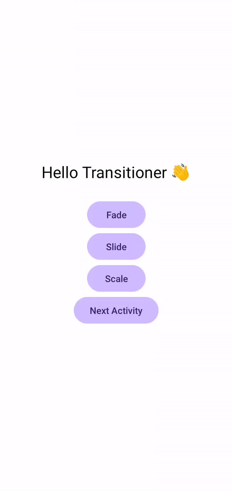

### Transitioner – Android Transition Library (Kotlin)
[](https://kotlinlang.org/)
[](LICENSE)
[](#)
---

Transitioner is a lightweight, easy-to-use Android library written in Kotlin that simplifies UI transitions and navigation animations.

It provides:

- View animations
- Activity & Fragment transitions
- Back press & finish animations
- XML-based configuration
- Clean and minimal API

### Features

**View Transitions**

Animate any view with:
- Fade
- Slide
- Scale

**Activity Transitions**

Smooth transitions when navigating between activities.

**Fragment Transitions**

Built-in fragment animations with proper back-stack handling.

**Back Press Animation**

Control how your activity exits when user presses back.

**finish() with Animation**

Finish activities with smooth exit transitions.

**XML Attribute Support**

Configure transitions directly from XML without writing Kotlin code.

---

### Preview

 

---

## Installation (JitPack)

### 1️⃣ Add JitPack to your **root `settings.gradle` or `build.gradle`**

```gradle
dependencyResolutionManagement {
    repositories {
        google()
        mavenCentral()
        maven { url 'https://jitpack.io' }
    }
}
```
### Add Dependency
```
dependencies {
	        implementation 'com.github.Excelsior-Technologies-Community:Android_Transitioner:1.0.0'
	}
```

---

### Basic Usage

View Transitions (Kotlin)
```kotlin
textView.transition(TransitionType.FADE)
```
With configuration:
```kotlin
textView.transition(
    TransitionType.SLIDE,
    TransitionConfig(duration = 500, startDelay = 100)
)
```

**Supported View Transitions**

- FADE
- Slide
- Scale

### Activity Transitions

Navigate between activities with animation:
```kotlin
Transitioner.startActivity(
    from = this,
    intent = Intent(this, SecondActivity::class.java),
    transition = ActivityTransition.SLIDE_RIGHT
)
```

**Supported Activity Transitions**

- FADE
- SLIDE_LEFT
- SLIDE_RIGHT
- SLIDE_UP
- SLIDE_DOWN

### Back Press Transition

Control animation when user presses back:
```kotlin
override fun onBackPressed() {
    Transitioner.onBackPressed(
        activity = this,
        transition = ActivityTransition.SLIDE_DOWN
    )
}
```

### finish() with Animation

```kotlin
Transitioner.finish(
    activity = this,
    transition = ActivityTransition.SLIDE_LEFT
)
```

### Fragment Transitions

Replace fragments with smooth animations:
```kotlin
Transitioner.replaceFragment(
    fragmentManager = supportFragmentManager,
    containerId = R.id.fragmentContainer,
    fragment = DetailsFragment(),
    transition = FragmentTransition.SLIDE_RIGHT,
    addToBackStack = true
)
```

**Supported Fragment Transitions**

- FADE
- SLIDE_LEFT
- SLIDE_RIGHT
- SLIDE_UP
- SLIDE_DOWN


### XML Attribute Configuration

Transitioner also supports XML-only usage.
```xml
<com.ext.transitioner.views.TransitionerTextView
    android:layout_width="wrap_content"
    android:layout_height="wrap_content"
    android:text="Hello Transitioner"
    app:transitionType="scale"
    app:transitionDuration="500"
    app:transitionAutoStart="true" />
```

---

### License

```
MIT License

Copyright (c) 2025 Excelsior Technologies 

Permission is hereby granted, free of charge, to any person obtaining a copy
of this software and associated documentation files (the "Software"), to deal
in the Software without restriction, including without limitation the rights
to use, copy, modify, merge, publish, distribute, sublicense, and/or sell
copies of the Software, and to permit persons to whom the Software is
furnished to do so, subject to the following conditions:

The above copyright notice and this permission notice shall be included in all
copies or substantial portions of the Software.

THE SOFTWARE IS PROVIDED "AS IS", WITHOUT WARRANTY OF ANY KIND, EXPRESS OR
IMPLIED, INCLUDING BUT NOT LIMITED TO THE WARRANTIES OF MERCHANTABILITY,
FITNESS FOR A PARTICULAR PURPOSE AND NONINFRINGEMENT. IN NO EVENT SHALL THE
AUTHORS OR COPYRIGHT HOLDERS BE LIABLE FOR ANY CLAIM, DAMAGES OR OTHER
LIABILITY, WHETHER IN AN ACTION OF CONTRACT, TORT OR OTHERWISE, ARISING FROM,
OUT OF OR IN CONNECTION WITH THE SOFTWARE OR THE USE OR OTHER DEALINGS IN THE
SOFTWARE.
```
